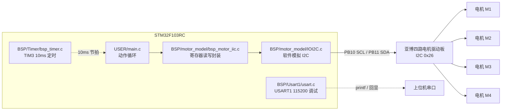
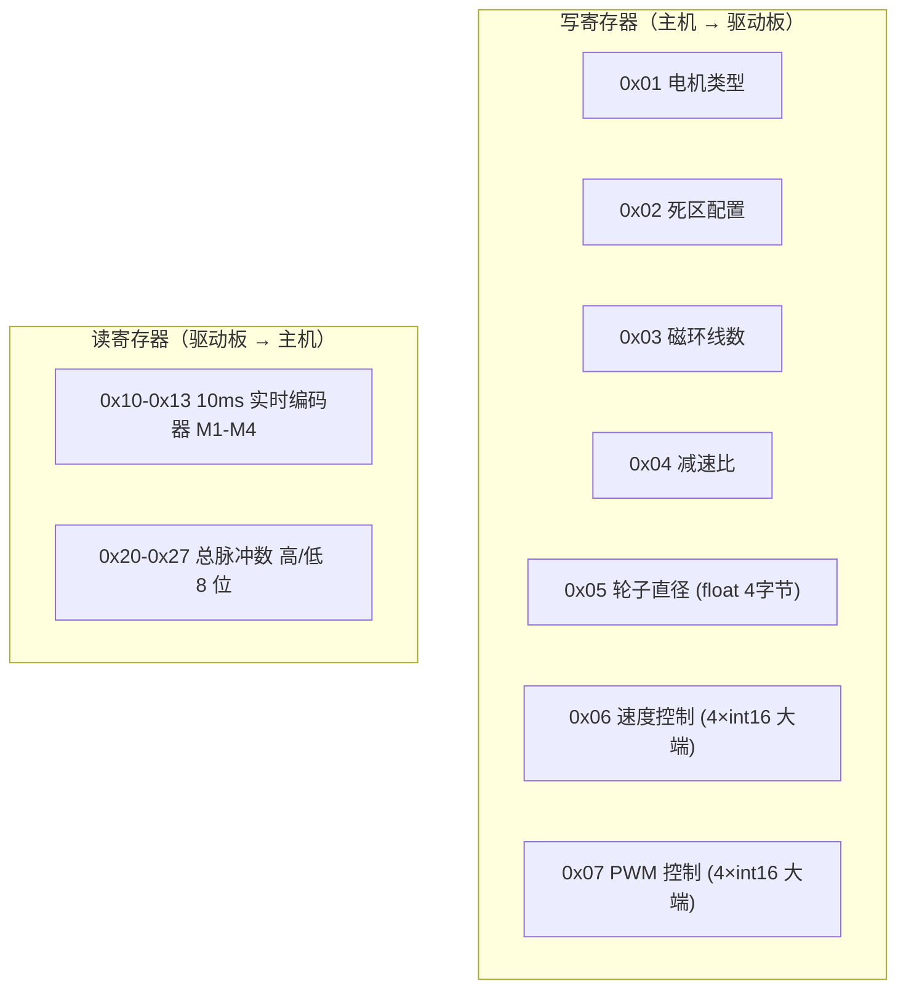
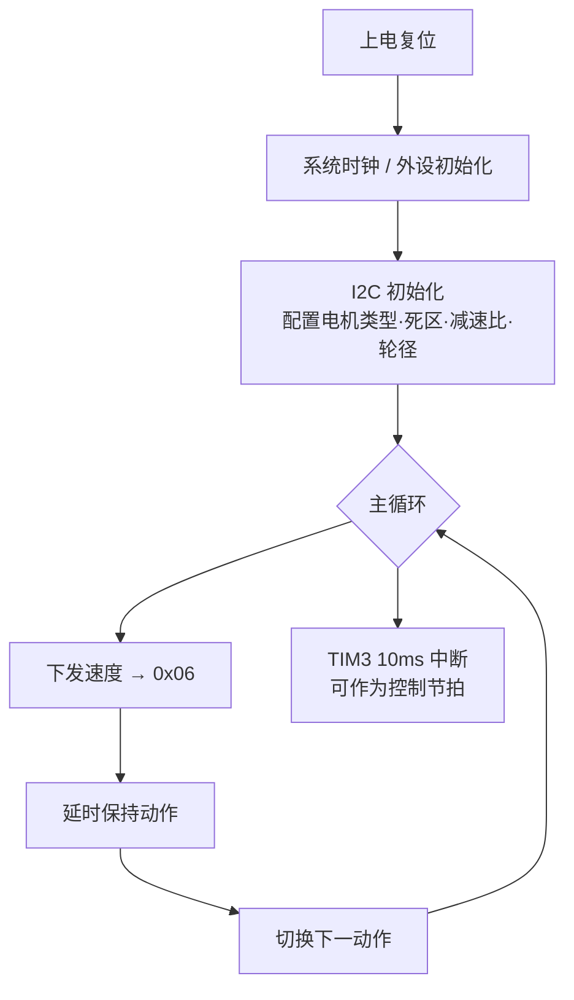

# CarMove_IIC

基于 STM32F103RC 的四轮小车电机控制例程：用**软件模拟 I2C** 驱动亚博（Yahboom）四路电机驱动板，实现前进 / 后退 / 转向 / 停止的动作循环，并通过 USART1 输出调试信息。

> 一句话概括：这不是一个完整的机器人工程，而是**「STM32 如何用 I2C 跟电机驱动板对话」的最小可跑通示例**。

---

## 硬件与开发环境

| 项 | 值 | 依据 |
|---|---|---|
| MCU | STM32F103RC | `USER/I2C.uvprojx` 中 `<Device>STM32F103RC` |
| 开发环境 | Keil MDK（uVision） | 工程文件 `I2C.uvprojx` / `I2C.uvoptx` |
| 启动文件 | `startup_stm32f10x_hd.s` | `CMSIS/` |
| 外设库 | STM32F10x 标准外设库（FWLib） | `FWLib/inc`、`FWLib/src` |
| 电机驱动板 | 亚博四路电机驱动板，I2C 从机地址 **0x26** | `BSP/motor_model/bsp_motor_iic.h` |

---

## 系统结构

---

## 目录说明

| 目录 | 内容 |
|---|---|
| `USER/` | 应用入口 `main.c`、中断服务函数 `stm32f10x_it.c`、Keil 工程文件 |
| `BSP/` | 板级驱动：`Delay/`、`Timer/`（TIM3）、`Usart1/`、`motor_model/`（I2C 电机） |
| `CMSIS/` | 内核与启动文件 |
| `FWLib/` | ST 标准外设库（inc / src） |

---

## I2C 寄存器协议

驱动板通过寄存器读写交互。以下映射直接来自 `bsp_motor_iic.h`：

- 速度 / PWM 寄存器（0x06 / 0x07）数据为 **4 个 int16，大端，共 8 字节**
- 编码器值由驱动板侧读取，MCU 通过 0x10–0x13 取 10ms 内的实时值
- 总脉冲数分高 / 低 8 位两个寄存器存放（0x20/0x21 为 M1，以此类推）

---

## 外设分配

| 外设 | 引脚 / 配置 | 文件 |
|---|---|---|
| 软件 I2C | PB10 = SCL，PB11 = SDA | `BSP/motor_model/IOI2C.c` |
| USART1 | PA9 / PA10，115200，仅调试打印与回显 | `BSP/Usart1/usart.c` |
| TIM3 | 预分频 7199、周期 99 → 10ms 定时中断 | `BSP/Timer/bsp_timer.c` |

> 本例程**没有**使用编码器接口、PWM 输出或 ADC —— 电机测速与驱动全部由驱动板完成，MCU 只通过 I2C 下发目标速度并回读编码器。

---

## 主流程

`USER/main.c` 在初始化后进入循环，依次执行前进、后退、转向、停止等动作；串口中断 `USART1_IRQHandler` 把收到的字节原样回发，用作链路自检。

---

## 编译与烧录

1. 用 Keil uVision 打开 `USER/I2C.uvprojx`
2. 选择目标 `I2C`，编译（Build）
3. 通过 ST-Link / J-Link 下载到 STM32F103RC

仓库内未提供命令行构建脚本；`OBJ/` 为 Keil 编译产物目录。

---

## 归属与许可证

- **本仓库未附带 LICENSE 文件**，版权状态以源码头部声明为准。
- 源码 `USER/AllHeader.h` 等文件带有版权头：
  `Copyright (C) 2016-2026, Shenzhen Yahboom Tech`，作者署名 `lly`。
  即本工程基于**亚博智能（Yahboom）**的电机驱动例程与协议实现，相关归属与权利归原作者所有。
- `CMSIS/`、`FWLib/` 为 STMicroelectronics 标准外设库，遵循其原始许可。

---

## 代码规模

| 范围 | 文件数 | 行数 |
|---|---|---|
| `BSP/` + `USER/`（本工程自研部分） | 19 个 .c/.h | 约 1335 行 |
| 含 `FWLib/` + `CMSIS/` | 70 个 .c/.h | — |

> 统计口径：仅 .c/.h/.s 源文件，不含 Keil 工程文件与编译产物。
